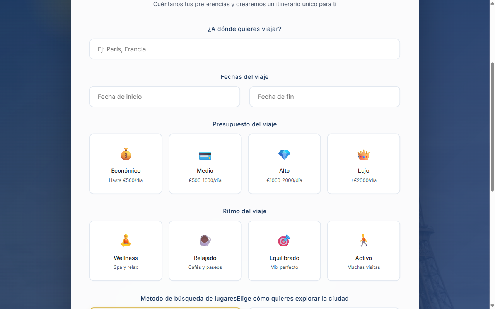
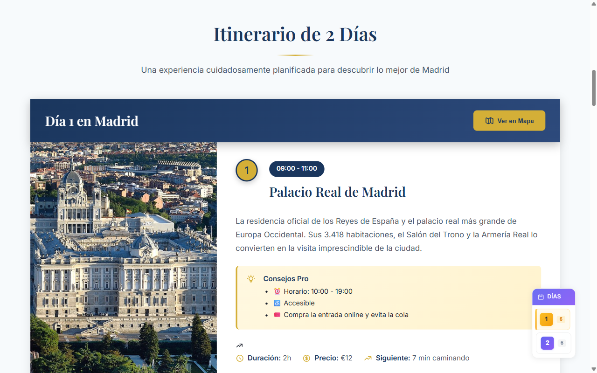
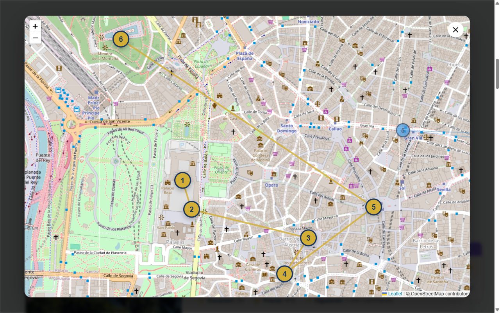
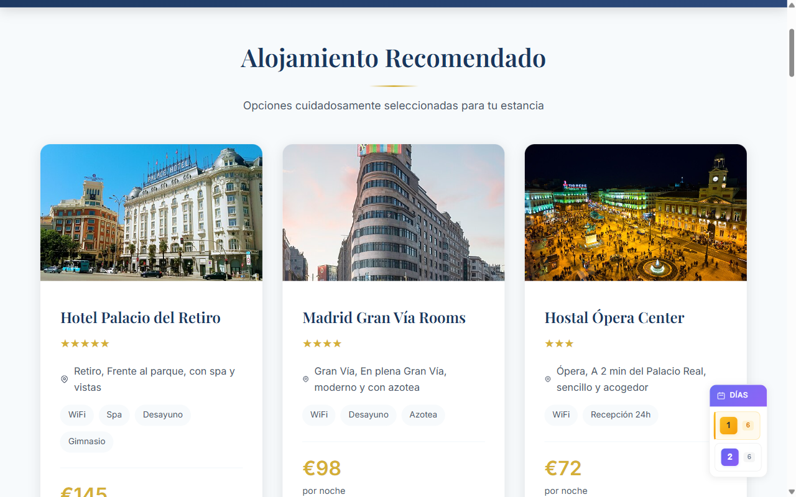

# TravelLux — planifica tu viaje perfecto en segundos

**TravelLux convierte un destino y dos fechas en un itinerario completo con puntos de interés reales, imágenes, precios, mapa y hoteles.**
Escribes adónde quieres ir, cuándo y con qué presupuesto; la aplicación busca monumentos, museos y rincones con datos de OpenStreetMap y Wikipedia, los reparte por días con horarios y te los pinta sobre un mapa. Sin hojas de cálculo, sin abrir veinte pestañas.


## Usarlo es así de fácil

1. **Dime adónde vas.** Un destino, las fechas, el presupuesto y el ritmo que prefieres (relajado, equilibrado o a tope).
2. **Pulsa el botón.** La aplicación busca cientos de lugares con calidad Wikipedia, elige los mejores repartidos por zonas y calcula cómo ir de uno a otro.
3. **Vive el plan.** Cada día es una lista con horario, duración, precio, consejos y foto de cada sitio.
4. **Elige dónde dormir.** Hoteles sugeridos según tu presupuesto, con precio por noche y zona.



## Tu viaje, día a día

Cada día viene con sus paradas ordenadas: foto real del lugar, horario, duración, precio, consejos prácticos y cuánto se tarda hasta la siguiente parada. Todo verificado con datos de OpenStreetMap y Wikipedia.



## Tu viaje, dibujado en el mapa

Cada día se puede ver sobre un mapa real: marcadores numerados en el orden de la visita y la ruta trazada entre ellos. Un clic en cualquier parada y saltas a su ficha.



## Dónde dormir, sin complicarte

Hoteles recomendados según el presupuesto que marcaste, con su zona, servicios y precio por noche. Menos pestañas abiertas, más vacaciones.



## Qué sabe hacer, en palabras normales

**Planificar el viaje**
- Busca puntos de interés reales de OpenStreetMap (con calidad Wikipedia/Wikidata): monumentos, museos, mercados, calles famosas, parques y miradores.
- Modo clásico (monumentos principales) o modo expandido (+450 % de lugares: plazas, barrios y rincones).
- Reparte los lugares por días usando clustering geográfico, para no cruzar la ciudad de punta a punta.
- Calcula el tiempo de transporte entre paradas y te dice cuánto se tarda a pie o en metro.
- Genera itinerarios de 1 a 15 días, con fechas en español y validación automática.
- Modo demo instantáneo: entra con `http://localhost:8080/?demo=madrid` y ve un viaje completo sin configurar nada.

**Imágenes y contenido**
- Foto real de cada punto de interés descargada de Wikipedia/Wikidata y servida a través del propio backend (con caché en disco), para que nunca veas una imagen rota.
- Descripciones desde la Wikipedia en español, consejos prácticos (horarios, accesibilidad, precio) y precios orientativos por lugar.

**Inteligencia artificial (opcional)**
- Con una API key de Google Gemini, el modo progresivo redacta el resumen del viaje, sugiere hoteles y crea eventos adicionales, enviándotelo todo en directo (SSE) con barra de progreso.
- Si la IA o la búsqueda fallan (límites de uso, servicio caído), la app avisa y siempre entrega un itinerario: nunca se queda en blanco.

## Ponerlo en marcha (5 minutos)

```bash
git clone https://github.com/cursospotiapp/travellux.git
cd travellux
npm install
```

Copia la plantilla de configuración y rellena tus claves:

```bash
copy .env.example .env
```

Abre el `.env` y pon tus valores:

| Clave | Dónde se consigue (gratis) |
|---|---|
| `GOOGLE_API_KEY` | En [Google AI Studio](https://aistudio.google.com/apikey): entra con tu cuenta de Google, pulsa *Create API key* y cópiala. Solo hace falta para el modo progresivo con IA; el resto de la app funciona sin ella. |
| `MODEL_NAME` | El modelo de Gemini a usar, por ejemplo `gemini-2.5-flash`. Ya viene puesto en la plantilla. |
| `OVERPASS_ENDPOINT` | Servidor de OpenStreetMap para la búsqueda de lugares. Ya viene puesto en la plantilla; no hace falta tocarlo. |

Arranca el backend y el frontend (dos terminales):

```bash
# Terminal 1 — API en http://localhost:3000
npm run server

# Terminal 2 — Web en http://localhost:8080
npm run dev
```

Abre `http://localhost:8080` y planea tu primer viaje. Para ver la demo instantánea con imágenes locales, entra en `http://localhost:8080/?demo=madrid`.

Las claves viven solo en tu `.env`, que nunca se sube al repositorio (está en el `.gitignore`). Sin `GOOGLE_API_KEY` la aplicación funciona igual: la búsqueda de lugares, el mapa, las imágenes y el itinerario no la necesitan.

## Con qué está hecho (para perfiles técnicos)

React 19 + Rsbuild, Node.js + Express, OpenStreetMap Overpass API, Wikipedia/Wikidata APIs con proxy de imágenes y caché en disco, Google Gemini (`@google/generative-ai`) con streaming SSE, Leaflet para mapas, Swiper para carruseles, AOS para animaciones, flatpickr para fechas y ESLint 9.

## Notas de uso

- La búsqueda de lugares usa servicios públicos gratuitos (Overpass y Wikipedia) que a veces están saturados; en ese caso la app muestra un itinerario de demostración y se recuperan los datos reales al reintentar.
- El tier gratuito de Gemini limita el número de peticiones al día; el modo progresivo con IA es opcional y el resto de la app no lo necesita.
- La primera generación de un destino tarda entre 20 y 60 segundos; las siguientes para el mismo destino son instantáneas gracias a la caché en disco.